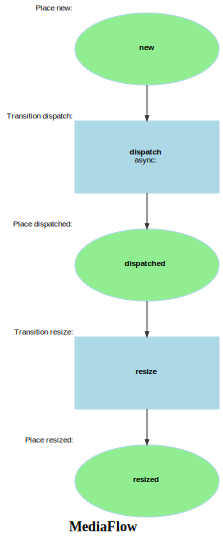

Markdown for MediaFlow




---
## Transition: dispatch

### dispatch.Transition

onDispatch()
        // 
        // 

```php
#[AsTransitionListener(MediaFlowDefinition::WORKFLOW_NAME, MediaFlowDefinition::TRANSITION_DISPATCH)]
public function onDispatch(TransitionEvent $event): void
{
    $media = $this->getMedia($event);

    // example call; replace with your actual params
    $response = $this->saisClientService->dispatchProcess(new ProcessPayload(
        root: '/some/root',
        args: [$media->getImageUrl()]
    ));

    // ...
}
```
[View source](pokemon/blob/main/src/Workflow/MediaWorkflow.php#L25-L36)


---
## Transition: resize

### resize.Transition

onResize()
        // 
        // 

```php
#[AsTransitionListener(MediaFlowDefinition::WORKFLOW_NAME, MediaFlowDefinition::TRANSITION_RESIZE)]
public function onResize(TransitionEvent $event): void
{
    $media = $this->getMedia($event);
    // ...
}
```
[View source](pokemon/blob/main/src/Workflow/MediaWorkflow.php#L39-L43)


