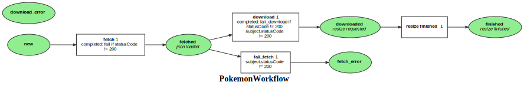

Markdown for PokemonWorkflow




## completed.fetch

```php
    #[AsCompletedListener(self::WORKFLOW_NAME, self::TRANSITION_FETCH)]
    public function asFetchCompleted(CompletedEvent $event): void
    {
        $pokemon = $this->getPokemon($event);
        if ($pokemon->getFetchStatusCode() !== 200) {
            $this->workflow->apply($pokemon, self::TRANSITION_FAIL_FETCH);
        }
    }
```
blob/main/src/Workflow/PokemonWorkflow.php#L58-64
        
    

## transition.download

```php
    #[AsTransitionListener(self::WORKFLOW_NAME, self::TRANSITION_DOWNLOAD)]
    public function onDownload(TransitionEvent $event): void
    {
        $pokemon = $this->getPokemon($event);
        $image = $pokemon->getImageUrl();
        $response = $this->saisClientService->dispatchProcess(new ProcessPayload(
             $this->rootDir,
            [$image],
        ));
        dd($response);
    }
```
blob/main/src/Workflow/PokemonWorkflow.php#L68-77
        
    
## transition.fetch

```php
    #[AsTransitionListener(self::WORKFLOW_NAME, self::TRANSITION_FETCH)]
    public function onFetch(TransitionEvent $event): void
    {
        $pokemon = $this->getPokemon($event);
        $url = $pokemon->getDetailUrl();
        $request = $this->httpClient->request('GET', $url);
        $statusCode = $request->getStatusCode();
        $pokemon
            ->setFetchStatusCode($statusCode);
        if ($statusCode === 200) {
            $details = json_decode($request->getContent(), true);
            $pokemon->setDetails($details);
```
blob/main/src/Workflow/PokemonWorkflow.php#L43-55
        
    