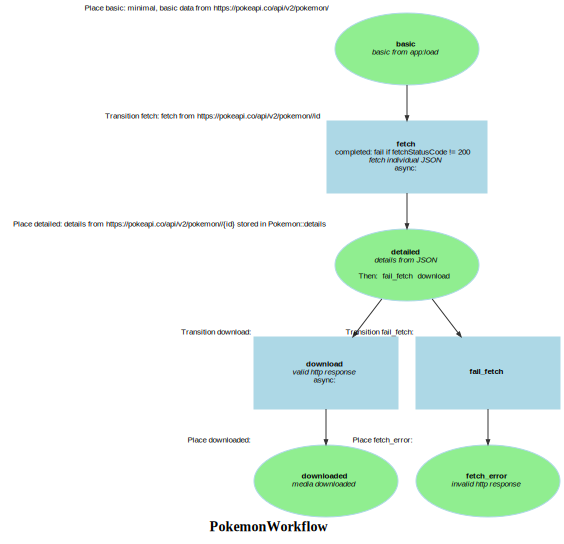

Markdown for PokemonWorkflow




---
## Transition: fetch

### fetch.Transition

onFetch()
        // fetch individual JSON
        // fetch from https://pokeapi.co/api/v2/pokemon//id

```php
#[AsTransitionListener(self::WORKFLOW_NAME, self::TRANSITION_FETCH)]
public function onFetch(TransitionEvent $event): void
{
    $pokemon = $this->getPokemon($event);
    $url = $pokemon->getDetailUrl();
    $request = $this->httpClient->request('GET', $url);
    $statusCode = $request->getStatusCode();
    $pokemon
        ->setFetchStatusCode($statusCode);
    if ($statusCode === 200) {
        $details = json_decode($request->getContent(), true);
        $pokemon->setDetails($details);
    }
}
```
[View source](pokemon/blob/main/src/Workflow/PokemonWorkflow.php#L43-L55)

### fetch.Completed

asFetchCompleted()
        // fetch individual JSON
        // fetch from https://pokeapi.co/api/v2/pokemon//id

```php
#[AsCompletedListener(self::WORKFLOW_NAME, self::TRANSITION_FETCH)]
public function asFetchCompleted(CompletedEvent $event): void
{
    $pokemon = $this->getPokemon($event);
    if ($pokemon->getFetchStatusCode() !== 200) {
        $this->workflow->apply($pokemon, self::TRANSITION_FAIL_FETCH);
    }
}
```
[View source](pokemon/blob/main/src/Workflow/PokemonWorkflow.php#L58-L64)


---
## Transition: download

### download.Transition

onDownload()
        // valid http response
        // 

```php
    #[AsTransitionListener(self::WORKFLOW_NAME, self::TRANSITION_DOWNLOAD)]
    public function onDownload(TransitionEvent $event): void
    {
        $pokemon = $this->getPokemon($event);
//        $image = $this->rootDir . $pokemon->getImageUrl();
        $imageUrl = sprintf('https://raw.githubusercontent.com/HybridShivam/Pokemon/master/assets/images/%03d.png', $pokemon->getId());
        $response = $this->saisClientService->dispatchProcess(new ProcessPayload(
             $this->rootDir,
            [$imageUrl],
            // @todo: resize callback,
        ));
        dump($response);
    }
```
[View source](pokemon/blob/main/src/Workflow/PokemonWorkflow.php#L68-L79)


